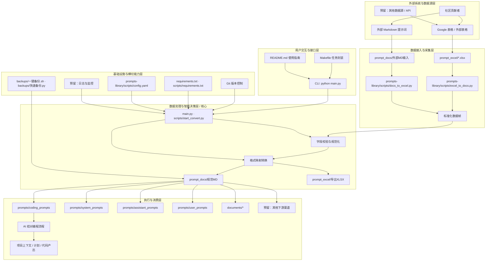
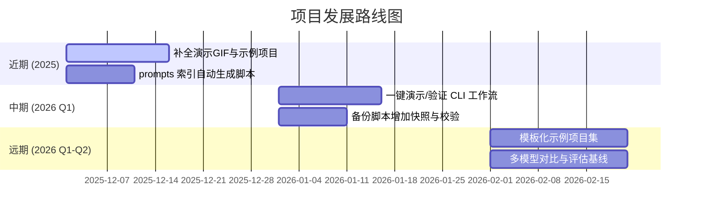

<!--
-------------------------------------------------------------------------------
  项目头部区域 (HEADER)
-------------------------------------------------------------------------------
-->
<p align="center">
  <!-- 建议尺寸: 1280x640px。可以使用 Canva, Figma 或 https://banners.beyondco.de/ 等工具制作 -->
  
</p>

<div align="center">

# Vibe Coding 指南

**一个旨在通过与 AI 结对编程，将概念转化为现实的综合工作流程**

---

<!--
  徽章区域 (BADGES)
-->
<p>
  <a href="https://github.com/tukuaiai/vibe-coding-cn/actions"></a>
  <a href="https://github.com/tukuaiai/vibe-coding-cn/releases"></a>
  <a href="LICENSE"></a>
  <a href="https://github.com/tukuaiai/vibe-coding-cn"></a>
  <a href="https://github.com/tukuaiai/vibe-coding-cn"></a>
  <a href="https://github.com/tukuaiai/vibe-coding-cn/graphs/contributors"></a>
  <a href="https://t.me/glue_coding"></a>
</p>

[📚 相关文档](#-相关文档与资源)
[🚀 入门指南](#-入门指南)
[⚙️ 完整设置流程](#️-完整设置流程)
[📞 联系方式](#-联系方式)
[✨ 支持项目](#-支持项目)
[🤝 参与贡献](#-参与贡献)

本仓库的 AI 解读链接：[zread.ai/tukuaiai/vibe-coding-cn](https://zread.ai/tukuaiai/vibe-coding-cn/1-overview)

</div>

---

## 🖼️ 概览

**Vibe Coding** 是一个与 AI 结对编程的综合工作流程，旨在帮助开发者高效地将想法付诸实践。本指南详细介绍了从项目构思、技术选型、实施规划到具体开发、调试和扩展的全过程，强调以**规划驱动**和**模块化**为核心，避免因缺乏有效管理而导致项目陷入混乱。

> **核心理念**: *规划是项目成功的基石。* 审慎地引导 AI 进行规划，以确保代码库的可维护性和可管理性。

**注意**：以下经验分享并非普遍适用，请在具体实践中结合场景，辩证采纳。

## 🔑 元方法论 (Meta-Methodology)

该思想的核心是构建一个能够**自我优化**的 AI 系统。其递归本质可分解为以下步骤：

#### 1. 定义核心角色：

*   **α-提示词 (生成器)**: 一个“母体”提示词，其唯一职责是**生成**其他提示词或技能。
*   **Ω-提示词 (优化器)**: 另一个“母体”提示词，其唯一职责是**优化**其他提示词或技能。

#### 2. 描述递归的生命周期：

1.  **创生 (Bootstrap)**:
    *   使用 AI 生成 `α-提示词` 和 `Ω-提示词` 的初始版本 (v1)。

2.  **自省与进化 (Self-Correction & Evolution)**:
    *   使用 `Ω-提示词 (v1)` **优化** `α-提示词 (v1)`，从而得到一个更强大的 `α-提示词 (v2)`。

3.  **创造 (Generation)**:
    *   使用**进化后的** `α-提示词 (v2)` 生成所有需要的目标提示词和技能。

4.  **循环与飞跃 (Recursive Loop)**:
    *   将新生成的、更强大的产物（甚至包括新版本的 `Ω-提示词`）反馈给系统，再次用于优化 `α-提示词`，从而启动下一轮进化。

#### 3. 终极目标：

通过此持续的**递归优化循环**，系统在每次迭代中实现**自我超越**，无限逼近预设的**理想状态**。

## 🧭 原则 (Principles)

* **凡是 ai 能做的，就不要人工做**
* **一切问题问 ai**
* **目的主导：开发过程中的一切动作围绕"目的"展开**
* **上下文是 vibe coding 的第一性要素，垃圾进，垃圾出**
* **系统性思考，实体，链接，功能/目的，三个维度**
* **数据与函数即是编程的一切**
* **输入，处理，输出刻画整个过程**
* **多问 ai 是什么？，为什么？，怎么做？**
* **先结构，后代码，一定要规划好框架，不然后面技术债还不完**
* **奥卡姆剃刀定理，如无必要，勿增代码**
* **帕累托法则，关注重要的那20%**
* **逆向思考，先明确你的需求，从需求逆向构建代码**
* **重复，多试几次，实在不行重新开个窗口，**
* **专注，极致的专注可以击穿代码，一次只做一件事（神人除外）**


## 🧩 方法 (Methods)

* **一句话目标 + 非目标**
* **正交性，功能不要太重复了，（这个分场景）**
* **能抄不写，不重复造轮子，先问 ai 有没有合适的仓库，下载下来改**
* **一定要看官方文档，先把官方文档爬下来喂给 ai**
* **按职责拆模块**
* **接口先行，实现后补**
* **一次只改一个模块**
* **文档即上下文，不是事后补**

## 🛠️ 技术 (Techniques)

* 明确写清：**能改什么，不能改什么**
* Debug 只给：**预期 vs 实际 + 最小复现**
* 测试可交给 AI，**断言人审**
* 代码一多就**切会话**

## 📋 器

- [**微软大战代码**](https://code.visualstudio.com/)，集成开发环境，初学者地基，你可以在这里手动修改和方便的阅读代码，cursor 更简单直观适合新手，插件现在应该只推荐一个就是 Local History
- **虚拟环境.venv**，有了这个再也不用装环境了，直接命令 ai 必须安装和全程使用虚拟环境（.venv）（记得写入你的AGENTS或者CLAUDE的md文件的记忆里面）就行了，一键配置好再也不用浪费时间配环境了，主要是适用于 python
- [**Claude Opus 4.5**](https://claude.ai/new)，在 Claude Code 中使用，很贵，但是尼区 iOS 订阅要便宜几百人民币，快 + 效果好，顶中顶，有 CLI 和 IDE 插件
- [**gpt-5.1-codex.1-codex (xhigh)**](https://chatgpt.com/codex/)，在 Codex CLI 中使用，顶中顶，除了慢其他没得挑，大项目复杂逻辑唯一解，买 ChatGPT 会员就能用，有 CLI 和 IDE 插件
- [**Droid**](https://factory.ai/news/terminal-bench)，这里面的 Claude Opus 4.5 体感比 Claude Code 原生还强，顶，有 CLI
- [**Kiro**](https://kiro.dev/)，这里面的 Claude Opus 4.5 目前免费，就是 CLI 看不到正在运行的情况，没有找到恢复对话，有客户端和 CLI
- [**Gemini CLI**](https://geminicli.com/)，目前免费用，干脏活用，Claude Code 或 Codex 写好的脚本拿它来执行可以，整理文档和找思路也合适，有客户端和 CLI
- [**antigravity**](https://antigravity.google/)，谷歌的，可以免费用 Claude Opus 4.5 和 Gemini 3.0 Pro，大善人
- [**AI Studio**](https://aistudio.google.com/prompts/new_chat)，谷歌家的，免费用 Gemini 3.0 Pro 和 Nano Banana
- [**Gemini Enterprise**](https://cloud.google.com/gemini-enterprise)，谷歌企业版，目前能免费用 Nano Banana Pro
- [**Augment**](https://app.augmentcode.com/)，上下文引擎和提示词优化按钮神中神，新手直接用它，点按钮自动帮你写好提示词，懒人必备
- [**Cursor**](https://cursor.com/)，已经占领用户心智高地，人尽皆知
- [**Windsurf**](https://windsurf.com/)，新用户有免费额度
- [**Ollama**](https://ollama.com/)，本地模型 CLI 管理器，拉模型、跑模型一条命令，可用本地部署一些开源的模型
- [**Warp**](https://www.warp.dev/)，AI 终端，体验不错，写命令和解释错误挺省心
- [**GitHub Copilot**](https://github.com/copilot)，没深度用过
- [**Kimi K2**](https://www.kimi.com/)，国产，还行，干脏活和简单任务用，之前 2 元一个 key，一周 1024 次调用，性价比高
- [**GLM**](https://bigmodel.cn/)，国产，听说很强，体感接近 Claude Sonnet 4
- [**Qwen**](https://qwenlm.github.io/qwen-code-docs/zh/cli/)，阿里出的，CLI 有免费额度
- [**提示词库（直接复制粘贴即可用）**](https://docs.google.com/spreadsheets/d/1ngoQOhJqdguwNAilCl1joNwTje7FWWN9WiI2bo5VhpU/edit?gid=2093180351#gid=2093180351&range=A1)
- [**其他编程工具的系统提示词学习库**](https://github.com/x1xhlol/system-prompts-and-models-of-ai-tools)
- [**Skills 制作器（下好后让 AI 按你的需求生成 Skills）**](https://github.com/yusufkaraaslan/Skill_Seekers)
- [**元提示词（生成提示词的提示词）**](https://docs.google.com/spreadsheets/d/1ngoQOhJqdguwNAilCl1joNwTje7FWWN9WiI2bo5VhpU/edit?gid=1770874220#gid=1770874220)
- [**通用项目架构模板**](./documents/通用项目架构模板.md)，一键丢给 AI 就能搭好目录结构
- [**Augment 提示词优化器**](https://app.augmentcode.com/)，提示词优化是真的好用，强烈推荐
- [**Mermaid Chart**](https://www.mermaidchart.com/)，架构 / 思维导图可视化，做架构图，序列图的时候复制到这里看
- [**NotebookLM**](https://notebooklm.google.com/)，资料 AI 解读、听音频、看思维导图、配合 Nano Banana 图片
- [**Zread**](https://zread.ai/)，AI 读 GitHub 仓库神器，减少造轮子
- [**元技能：Skills 的 Skills**](./skills/claude-skills/SKILL.md)，就是生成 Skills 的 Skills
- [**tmux快捷键大全**](./documents/tmux快捷键大全.md)，远程链接ssh用，再也不怕ssh端了终端会话丢失了
- [**二哥的Java进阶之路**](https://javabetter.cn/)，里面有小工具的详细配置教程
- [**tmux**](https://github.com/tmux/tmux)，终端复用神器，一个窗口顶多个终端会话，分屏、会话保持、远程不断线，服务器党 / 多项目并行必备
- [**nvim**](https://github.com/neovim/neovim)，现代化 Vim，插件生态成熟、性能极强，适合写代码、改配置、SSH 远程干活，键盘流天花板
- [**LazyVim**](https://github.com/LazyVim/LazyVim)，基于 Neovim 的成体系配置框架，预置 LSP / 补全 / 调试 / Git 等全套能力，开箱即用又能逐步深度定制，不想从零配 nvim 的最优解
- [**LazyVim快捷键大全**](./documents/LazyVim快捷键大全.md)，系统掌握 LazyVim 键盘流，提升编码效率
- [**DBeaver**](https://dbeaver.io/)，全能数据库客户端，支持 MySQL / PostgreSQL / SQLite / ClickHouse 等，连本地、服务器、SSH 隧道都很顺，查数据、改表结构、看执行计划都很舒服，工程党必备
- [**虚拟卡**](https://www.bybit.com/cards/?ref=YDGAVPN&source=applet_invite)，注册有这个卡你可以注册 aws 赠送的 100 美金的服务器额度，可以用很久，选澳大利亚地区的通过很快

---

## 编码模型性能分级参考

建议只选择第一梯队模型处理复杂任务，以确保最佳效果与效率。

*   **第一梯队**: `codex-5.1-max-xhigh`, `claude-opus-4.5-xhigh`, `gpt-5.2-xhigh`
*   **第二梯队**: `claude-sonnet-4.5`, `kimi-k2-thinking`, `minimax-m2`, `glm-4.6`, `gemini-3.0-pro`, `gemini-2.5-pro`
*   **第三梯队**: `qwen3`, `SWE`, `grok4`

---

## 📚 相关文档与资源

*   **交流社区**:
    *   [Telegram 交流群](https://t.me/glue_coding)
    *   [Telegram 频道](https://t.me/tradecat_ai_channel)
*   **个人分享**:
    *   [我的学习经验](./documents/学习经验.md)
    *   [编程书籍推荐](./documents/编程书籍推荐.md)
*   **核心资源**:
    *   [**元提示词库**](https://docs.google.com/spreadsheets/d/1ngoQOhJqdguwNAilCl1joNwTje7FWWN9WiI2bo5VhpU/edit?gid=1770874220#gid=1770874220): 用于生成提示词的高级提示词集合。
    *   [**元技能 (Meta-Skill)**](./skills/claude-skills/SKILL.md): 用于生成 Skills 的 Skill。
    *   [**技能库 (Skills)**](./skills): 可直接集成的模块化技能仓库。
    *   [**技能生成器**](https://github.com/yusufkaraaslan/Skill_Seekers): 将任何资料转化为 Agent 可用技能的工具。
    *   [**在线提示词数据库**](https://docs.google.com/spreadsheets/d/1ngoQOhJqdguwNAilCl1joNwTje7FWWN9WiI2bo5VhpU/edit?gid=2093180351#gid=2093180351&range=A1): 包含数百个适用于各场景的用户及系统提示词的在线表格。
    *   [**第三方系统提示词仓库**](https://github.com/x1xhlol/system-prompts-and-models-of-ai-tools): 汇集了多种 AI 工具的系统提示词。
*   **项目内部文档**:
    *   [**prompts-library 工具说明**](./libs/external/prompts-library/): 该工具支持在 Excel 和 Markdown 格式之间转换提示词，并包含数百个精选提示词。
    *   [**coding_prompts 集合**](./prompts/coding_prompts/): 适用于 Vibe Coding 流程的专用提示词。
    *   [**系统提示词构建原则**](./documents/系统提示词构建原则.md): 关于如何构建高效、可靠的 AI 系统提示词的综合指南。
    *   [**开发经验总结**](./documents/开发经验.md): 包含变量命名、文件结构、编码规范、架构原则等实践经验。
    *   [**通用项目架构模板**](./documents/通用项目架构模板.md): 提供多种项目类型的标准目录结构与最佳实践。
    *   [**Augment MCP 配置文档**](./documents/auggie-mcp配置文档.md): Augment 上下文引擎的详细配置说明。
    *   [**system_prompts 集合**](./prompts/system_prompts/): 用于指导 AI 开发的系统提示词，包含多个版本的开发规范与思维框架。

---

### 项目目录结构概览

`vibe-coding-cn` 项目的核心是围绕知识管理、AI 提示词的组织与自动化而构建。以下是其简化的目录结构说明：

```
.
├── backups/                     # 项目备份脚本。
├── documents/                   # 各类说明文档、经验总结和配置详情。
├── libs/                        # 通用库代码，包含内部模块和外部工具。
│   ├── common/                  # 通用功能模块。
│   ├── database/                # 数据库相关模块。
│   └── external/                # 外部集成工具，如 prompts-library。
├── prompts/                     # 核心资产：集中管理的各类型 AI 提示词。
│   ├── coding_prompts/          # 编程与代码生成专用提示词。
│   ├── system_prompts/          # AI 系统级行为与框架提示词。
│   └── user_prompts/            # 用户自定义提示词。
├── skills/                      # 模块化技能库，提供特定领域的工具和知识。
│
├── .gitignore                   # Git 忽略文件配置。
├── AGENTS.md                    # AI Agent 的行为准则与配置。
├── CLAUDE.md                    # Claude 模型的核心行为准则与配置。
├── CODE_OF_CONDUCT.md           # 社区行为准则。
├── CONTRIBUTING.md              # 贡献指南。
├── GEMINI.md                    # Gemini 模型的上下文与指令。
├── LICENSE                      # 项目开源许可证。
├── Makefile                     # 项目自动化任务脚本（如代码检查、备份）。
└── README.md                    # 项目主文档。
```

---

## ⚙️ 架构与工作流程

Vibe Coding 的核心工作流可以概括为：**规划驱动 + 上下文固定 + AI 结对执行**。它旨在将“从想法到可维护代码”的过程转变为一个可审计、可迭代的流水线。

**您将获得**:
- **成体系的提示词工具链**: 利用 `system_prompts` 约束 AI 行为边界，`coding_prompts` 提供从需求澄清、规划到执行的全链路支持。
- **闭环交付路径**: 遵循“需求 -> 上下文文档 -> 实施计划 -> 分步实现 -> 测试 -> 进度记录”的流程，确保全程可追溯、可移交。



---

<details>
<summary>📈 性能基准 (可选)</summary>

本仓库主要关注流程与提示词质量，而非代码性能。建议通过以下可观测指标进行追踪（当前依赖人工记录）：

| 指标 | 含义 | 建议记录方式 |
|:---|:---|:---|
| 提示命中率 | 一次生成即满足验收标准的比例。 | 在任务完成后于 `progress.md` 中记录 0/1。 |
| 周转时间 | 从需求提出到首个可运行版本所需的时间。 | 通过录屏或 CLI 定时器进行统计。 |
| 变更可追溯性 | 是否同步更新了上下文、进度及备份。 | 通过手动更新或在备份脚本中集成版本标签实现。 |
| 示例覆盖率 | 是否为每个模块提供了最小可运行示例或测试用例。 | 建议每个示例项目都包含独立的 README 和测试。 |

</details>

---

## 🗺️ 路线图



---

## 🚀 入门指南
*本节内容源自原作者，并根据当前推荐模型进行了更新。*

要开始使用 Vibe Coding，您需要以下任一工具：
- **Claude 3 Opus** (在 Claude Code 等平台使用)
- **GPT-4/GPT-5 系列模型** (在 Codex CLI 等平台使用)

本指南适用于 CLI 终端版本和 VSCode 扩展版本。

---

<details>
<summary><strong>⚙️ 完整设置流程</strong></summary>

<details>
<summary><strong>1. 创建项目设计文档</strong></summary>

-   将您的项目创意提交给 AI，并要求其生成一份简洁的 Markdown 格式**设计文档**（例如 `product-requirement-document.md`）。
-   审查并完善该文档，确保其与您的愿景一致。初期版本可以简略，其核心目标是为 AI 提供关于项目结构和意图的上下文。

</details>

<details>
<summary><strong>2. 确定技术栈并配置 AI 行为准则</strong></summary>

-   让 AI 为您的项目推荐**最简单且最健壮**的技术栈，并保存为 `tech-stack.md`。
-   在 AI 交互工具（如 Claude Code 或 Codex CLI）中，使用 `/init` 命令初始化 AI 的行为准则，使其读取您已创建的 `.md` 文件。
-   **关键步骤**: 审查并调整生成的规则，确保其强调**模块化**并禁止生成**单体巨文件**。部分核心规则必须设为始终应用（"Always"），以强制 AI 在编码前阅读关键上下文文档。

</details>

<details>
<summary><strong>3. 制定实施计划</strong></summary>

-   将设计文档和技术栈文档提供给 AI。
-   要求 AI 生成一份详细的 Markdown 格式**实施计划**，其中包含一系列给开发者的分步指令。
    -   每一步都应小而具体，并包含验证其正确性的测试方法。
    -   计划中只应包含清晰的指令，而非代码。
    -   初期聚焦于**核心功能**的实现。

</details>

<details>
<summary><strong>4. 构建记忆库 (Memory Bank)</strong></summary>

-   在项目根目录下创建 `memory-bank` 子文件夹。
-   将以下文件存入该文件夹：
    -   `product-requirement-document.md`
    -   `tech-stack.md`
    -   `implementation-plan.md`
    -   `progress.md` (空文件，用于记录开发进度)
    -   `architecture.md` (空文件，用于记录系统架构)

</details>

</details>

<details>
<summary><strong>💻 Vibe Coding 开发流程</strong></summary>

现在，我们开始核心开发流程。

<details>
<summary><strong>1. 澄清与确认</strong></summary>

-   启动 AI 交互工具。
-   **提问**: "请阅读 `/memory-bank` 文件夹中的所有文档。`implementation-plan.md` 的内容是否完全清晰？您有哪些问题需要我澄清，以确保计划对您而言是 100% 明确的？"
-   在回答完 AI 的所有问题后，让其根据您的回答更新 `implementation-plan.md`。

</details>

<details>
<summary><strong>2. 执行第一步</strong></summary>

-   **提问**: "请阅读 `/memory-bank` 中的所有文档，并执行实施计划的第 1 步。测试将由我负责。在测试通过之前，请不要开始第 2 步。验证通过后，请在 `progress.md` 中记录已完成的工作，并在 `architecture.md` 中更新架构信息。"
-   建议使用 "Ask" 或 "Plan" 模式，在 AI 执行前确认其计划。

</details>

<details>
<summary><strong>3. 迭代工作流</strong></summary>

-   完成第 1 步后，提交代码变更到 Git。
-   开始新的会话，并提问："请阅读 memory-bank 中的所有文件，并参考 `progress.md` 了解当前进度，然后继续实施计划的第 2 步。"
-   重复此流程，直至完成整个实施计划。

</details>

</details>

<details>
<summary><strong>✨ 增补功能</strong></summary>

在完成核心功能后，您可以开始进行实验和功能扩展。
-   对于每个主要的新功能，创建一个独立的 `feature-implementation.md`，其中包含简短的步骤和测试方法。
-   继续采用增量式的方式实现和测试。

</details>

<details>
<summary><strong>🐞 故障排查</strong></summary>

<details>
<summary><strong>常规修复</strong></summary>

-   **回滚**: 如果 AI 的某次操作导致问题，使用版本控制工具（如 `git reset`）或 AI 工具自带的回滚命令（如 `/rewind`）恢复到之前的状态。
-   **错误处理**: 将浏览器控制台中的错误信息或问题截图提供给 AI 进行分析。

</details>

<details>
<summary><strong>疑难问题</strong></summary>

-   **重试**: 如果某个问题难以解决，回退到上一个稳定的版本，并尝试用不同的提示词或方法重新实现。
-   **全局上下文**: 在极端情况下，可使用 `RepoPrompt` 等工具将整个代码库打包为一个文件，并提交给 AI 以获得全局性的解决方案。

</details>

</details>

<details>
<summary><strong>💡 提示与技巧</strong></summary>

<details>
<summary><strong>AI 工具使用技巧</strong></summary>

-   **终端集成**: 在 VSCode 终端中运行 AI CLI 工具，可以直接查看文件差异并提供上下文，无需离开工作区。
-   **自定义命令**: 创建自定义快捷命令，以触发特定提示词，从而让模型在修改代码前充分理解上下文。
-   **上下文管理**: 适时使用 `/clear` 或 `/compact` 等命令清理或压缩上下文。
-   **高阶指令**: 通过加入 "请一步一步思考" 或 "ultrathink" 等关键词，引导 AI 进行更深度的思考。

</details>

</details>

<details>
<summary><strong>❓ 常见问题解答 (FAQ)</strong></summary>

-   **Q: 此流程是否适用于非游戏应用开发？**
    -   **A:** 是的，基本流程完全适用。只需将“游戏设计文档”替换为“产品需求文档 (PRD)”即可。

-   **Q: 为何推荐使用原生 CLI 工具而非 Cursor 等集成环境？**
    -   **A:** 这主要取决于个人偏好。我们认为原生 CLI 工具能更好地发挥底层模型的全部实力，并且具有更强的灵活性和可定制性，适用于远程服务器等多种场景。

-   **Q: 我不了解如何搭建服务器，该怎么办？**
    -   **A:** 请咨询您的 AI 助手。

</details>

---

## 📞 联系方式

-   **GitHub**: [tukuaiai](https://github.com/tukuaiai)
-   **Twitter / X**: [123olp](https://x.com/123olp)
-   **Telegram**: [@desci0](https://t.me/desci0)
-   **Telegram 交流群**: [glue_coding](https://t.me/glue_coding)
-   **Telegram 频道**: [tradecat_ai_channel](https://t.me/tradecat_ai_channel)
-   **邮箱**: tukuai.ai@gmail.com (回复可能不及时)

---

## ✨ 支持项目

救救孩子，感谢了，好人一生平安🙏🙏🙏

-   **Tron (TRC20)**: `TQtBXCSTwLFHjBqTS4rNUp7ufiGx51BRey`
-   **Solana**: `HjYhozVf9AQmfv7yv79xSNs6uaEU5oUk2USasYQfUYau`
-   **Ethereum (ERC20)**: `0xa396923a71ee7D9480b346a17dDeEb2c0C287BBC`
-   **BNB Smart Chain (BEP20)**: `0xa396923a71ee7D9480b346a17dDeEb2c0C287BBC`
-   **Bitcoin**: `bc1plslluj3zq3snpnnczplu7ywf37h89dyudqua04pz4txwh8z5z5vsre7nlm`
-   **Sui**: `0xb720c98a48c77f2d49d375932b2867e793029e6337f1562522640e4f84203d2e`
-   **币安 UID**: `572155580`

---

### ✨ 贡献者

感谢所有为本项目做出贡献的开发者！

<a href="https://github.com/tukuaiai/vibe-coding-cn/graphs/contributors">
  
  
</a>

<p>特别鸣谢以下成员的宝贵贡献 (排名不分先后):<br/>
<a href="https://x.com/shao__meng">@shao__meng</a> |
<a href="https://x.com/0XBard_thomas">@0XBard_thomas</a> |
<a href="https://x.com/Pluvio9yte">@Pluvio9yte</a> |
<a href="https://x.com/xDinoDeer">@xDinoDeer</a> |
<a href="https://x.com/geekbb">@geekbb</a>
</p>

---

## 🤝 参与贡献

我们热烈欢迎各种形式的贡献。如果您对本项目有任何想法或建议，请随时开启一个 [Issue](https://github.com/tukuaiai/vibe-coding-cn/issues) 或提交一个 [Pull Request](https://github.com/tukuaiai/vibe-coding-cn/pulls)。

在您开始之前，请花时间阅读我们的 [**贡献指南 (CONTRIBUTING.md)**](CONTRIBUTING.md) 和 [**行为准则 (CODE_OF_CONDUCT.md)**](CODE_OF_CONDUCT.md)。

---

## 📜 许可证

本项目采用 [MIT](LICENSE) 许可证。

---

<div align="center">

**如果这个项目对您有帮助，请考虑为其点亮一颗 Star ⭐！**

## Star History

<a href="https://www.star-history.com/#tukuaiai/vibe-coding-cn&type=date&legend=top-left">
 <picture>
   <source media="(prefers-color-scheme: dark)" srcset="https://api.star-history.com/svg?repos=tukuaiai/vibe-coding-cn&type=date&theme=dark&legend=top-left" />
   <source media="(prefers-color-scheme: light)" srcset="https://api.star-history.com/svg?repos=tukuaiai/vibe-coding-cn&type=date&legend=top-left" />
   
 </picture>
</a>

---

**由 [tukuaiai](https://github.com/tukuaiai), [Nicolas Zullo](https://x.com/NicolasZu), 和 [123olp](https://x.com/123olp) 倾力打造**

[⬆ 返回顶部](#vibe-coding-指南)
</div>
